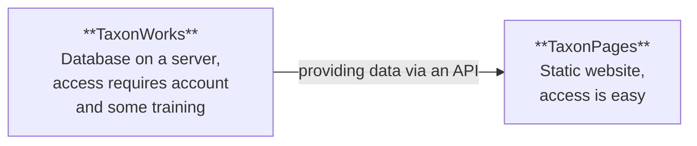

## Introduction
**Welcome on board!**  
This page is a guide for everyone who would like to contribute to the Curculionoidea Project on TaxonWorks.

### What you could do
TaxonWorks is an excellent tool for you to organize your taxonomic knowledge. Having everything in TaxonWorks can aid your research while also helping the broader community and building a lasting resource.

If you don't want to work in TaxonWorks yourself, you can also just provide data (images, taxonomic lists, specimen/occurrence data from a collection, etc.) and we can integrate it for you. You can be cited/attributed for everything you want to share.

### TaxonWorks vs. TaxonPages
[TaxonWorks](https://taxonworks.org/) is the software that we use to curate data. It lives on a server and is accessed through your internet browser.  
For our project, the instance of TaxonWorks is hosted at [https://sfg.taxonworks.org/](https://sfg.taxonworks.org/)

[TaxonPages](https://github.com/SpeciesFileGroup/taxonpages) is a tool that draws data from TaxonWorks' API. It is facilitating easy access to the data for the public. It's designed to be simple and intuitive, but it doesn't provide the advanced features that TaxonWorks has to access and filter data.  
You don't need to care about TaxonPages at all: As you curate data in TaxonWorks, TaxonPages will display everything you add automatically.  
For our project, the instance of TaxonPages is hosted at [https://catalog.curculionoidea.org](https://catalog.curculionoidea.org).

### Who is Who
#### Contact to the weevil project members
You can see the list of contributors to Curculionidae of the World Online at [catalog.curculionoidea.org/#/about](https://catalog.curculionoidea.org/#/about)  
We are the ones who curate weevil data in TaxonWorks. Most of us are also part of the [Weevil Workers](https://www.curculionoidea.org/) community.  
Communication is primarily via email, but we also have a weekly online meeting. If you need to discuss something, please let us know beforehand, as not everyone is participating every week if there are no topics.

#### Contact to the broader TaxonWorks community
If you need help with TaxonWorks, please ask other members of the weevil community first. We can help with most problems.  

The TaxonWorks software, as well as TaxonPages, are developed by the [Species File Group (SFG)](https://speciesfilegroup.org/).  
The instance of TaxonWorks that the weevil project is using is hosted on the servers of the SFG. The weevil community is **not part of the SFG**.  
Learn more about the collaboration between us (as scientists) and the SFG on the [SFG website](https://speciesfilegroup.org/docs/taxonworks_in_production_at_sfg.html).  
The SFG has a weekly online [community consult](https://speciesfilegroup.org/events.html). There's also the annual conference [TaxonWorks Together](https://together.taxonworks.org/).
## Getting started
1. Contact WeevilWorkers@gmail.com to get your account for TaxonWorks. If we don't know you yet, you may introduce yourself a bit :)
2. You will get login credentials for the [production instance of TaxonWorks](https://sfg.taxonworks.org/) (where the real project data is maintained) as well as for a sandbox, where you can test features without messing with our real dataset.
3. We suggest you to use the sandbox environment to familiarize yourself with the program. You can also ask us (weevil community members) for assistance. We could also work together with a shared screen if needed.

